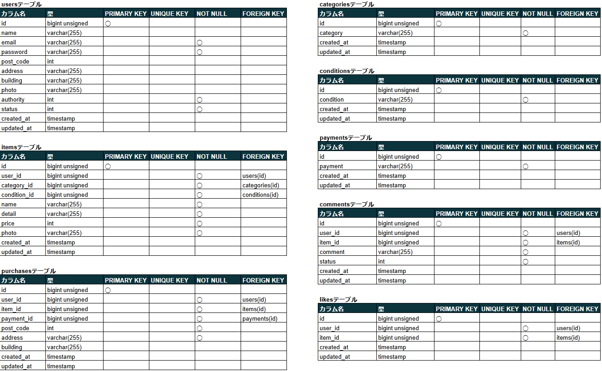
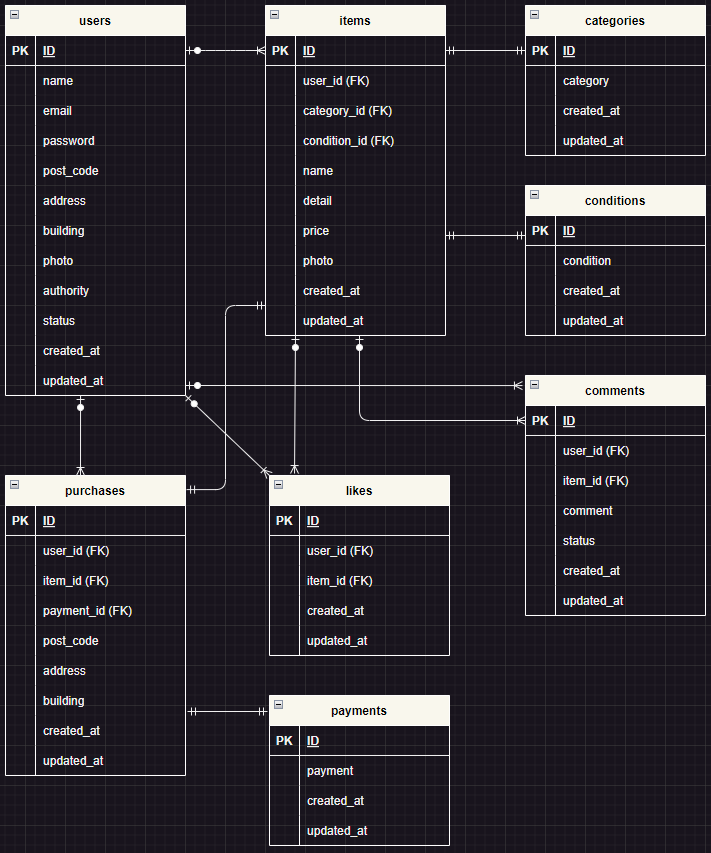

# advance-test-second

# アプリケーション名

- coachtech フリマ
- ある企業が開発した独自のフリマアプリ

# 作成した目的

- coachtech ブランドのアイテムを出品するフリマアプリの制作

# 機能一覧

- 会員登録
- ログイン
- ログアウト
- 商品 一覧表示
- 商品 キーワード検索
- お気に入り商品一覧表示
- マイページ表示
- プロフィール編集機能(会員)
- 商品 出品(会員)
- 商品 購入(会員)
- 商品 お気に入り 追加・削除(会員)
- 商品 コメント 追加・削除(会員)
- 支払い方法 変更(会員)
- 配送先 変更(会員)
- クレジット支払い機能
- 管理画面表示(管理者)
- ユーザーアカウント停止・再開(管理者)
  (アカウント停止ユーザーはログイン不可になる)
- ユーザー削除(管理者)
- コメント表示・非表示(管理者)
- コメント削除(管理者)
- 会員へのメール送信(管理者)

# 使用技術(実行環境)

- PHP 7.4.9
- Laravel 8.83.27
- MySQL 8.0.26
- nginx 1.21.1

# テーブル設計



# ER 図



# 環境構築

**Docker ビルド**

1. `git clone git@github.com:ueppa0716/advance-test.git`
2. DockerDesktop アプリを立ち上げる
3. `docker-compose up -d --build`

**Laravel 環境構築**

1. `docker-compose exec php bash`
2. `composer install`
3. 「.env.example」ファイルを 「.env」ファイルに命名を変更。または、新しく.env ファイルを作成
4. .env に以下の環境変数を追加

```text
DB_CONNECTION=mysql
DB_HOST=mysql
DB_PORT=3306
DB_DATABASE=laravel_db
DB_USERNAME=laravel_user
DB_PASSWORD=laravel_pass
```

5. アプリケーションキーの作成

```bash
php artisan key:generate
```

6. マイグレーションの実行

```bash
php artisan migrate
```

7. シーディングの実行

```bash
php artisan db:seed
```

8. パブリックにアクセス可能なディレクトリへのシンボリックリンクを作成

```bash
php artisan storage:link
```

**PHPUnit テスト**
※アカウント停止ユーザーのログイン不可について確認可能

1. 「.env.example」ファイルを 「.env」ファイルに命名を変更。または、新しく.env ファイルを作成
2. .env に以下の環境変数を追加

```text
DB_CONNECTION=mysql
DB_HOST=127.0.0.1
DB_PORT=3306
DB_DATABASE=laravel_test_db
DB_USERNAME=test_user
DB_PASSWORD=test_password

BROADCAST_DRIVER=log
CACHE_DRIVER=array
FILESYSTEM_DRIVER=local
QUEUE_CONNECTION=sync
SESSION_DRIVER=array
SESSION_LIFETIME=120
```

3. phpunit.xml でテスト用のデータベースを設定する

```text
<php>
    <server name="APP_ENV" value="testing"/>
    <server name="BCRYPT_ROUNDS" value="4"/>
    <server name="CACHE_DRIVER" value="array"/>
    <server name="DB_CONNECTION" value="sqlite"/>
    <server name="DB_DATABASE" value=":memory:"/>
    <server name="MAIL_MAILER" value="array"/>
    <server name="QUEUE_CONNECTION" value="sync"/>
    <server name="SESSION_DRIVER" value="array"/>
    <server name="TELESCOPE_ENABLED" value="false"/>
</php>
```

4. テストの実行
   php artisan test --env=testing --filter=LoginControllerTest
